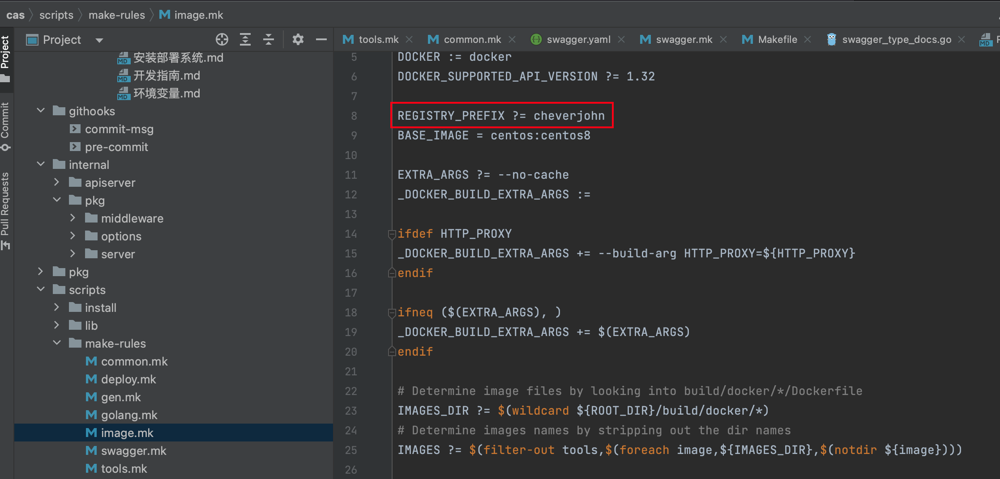
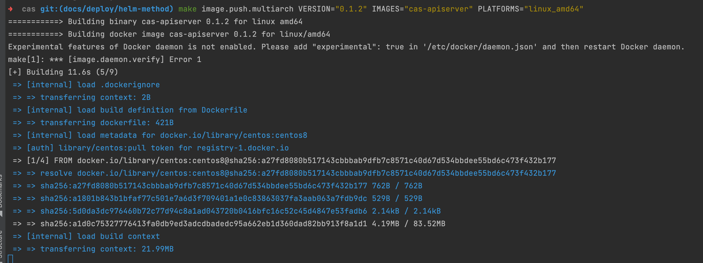
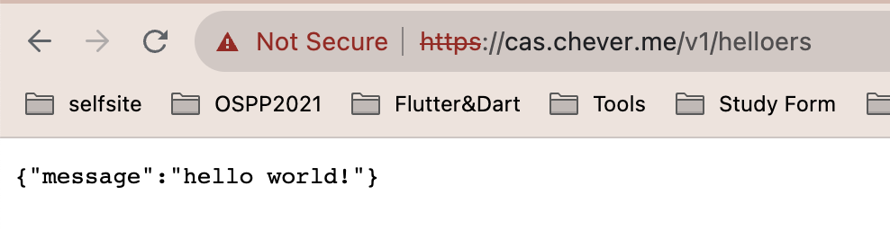

# 使用 helm 在 kubernetes 中部署本项目

首先肯定已经 `git clone` 项目到本地了是吧？

## 上传镜像到自己的景象仓库中去

这里以默认的 Docker Hub 为例。

然后就是进入到项目的根目录，在 `docker login` 的前提下，开始运行下面的命令：

```bash
make image.push.multiarch VERSION="0.1.2" IMAGES="cas-apiserver" PLATFORMS="linux_amd64"
```

当然在运行上面命令的前提是，我这边已经设置了默认的 `REGISTRY_PREFIX` 为 cheverjohn 了，如果你需要设置成自己的，可以将上面的命令修改为：

```bash
make image.push.multiarch VERSION="0.1.2" IMAGES="cas-apiserver" PLATFORMS="linux_amd64" REGISTRY_PREFIX="ur registry prefix"
```



然后运行命令的图片如下：



## 配置文件上传到 k8s 的 configmap 中

首先生成配置文件的命令如下：

```bash
GEN_CFG_ENV="Linux" ./scripts/generate_config.sh ./scripts/install/environment.sh ./configs/lbctrl-dnser.yaml > lbctrl-dnser.yaml
```

因为我的 k8s 机器是 amd 架构的，所以我这边选择生成 linux 的配置文件。

命令如下：

```bash
kubectl -n cas create configmap cas --from-file=_output/configs/
```

## 使用 helm 命令

### 部署

在根目录，命令如下：

```bash
helm install cas-apiserver -ncas deployments/cas-apiserver
```

### 升级

在根目录，命令如下：

```bash
helm upgrade cas-apiserver -ncas deployments/cas-apiserver 
```

### 检查

在根目录，命令如下：

```bash
helm  lint deployments/cas-apiserver                       
```

第二个命令，如下：

```bash
helm template deployments/cas-apiserver --dry-run
```

## 暴露服务

这里需要使用到 ingress-nginx-controller，需要确保这个组件被安装在集群中了。然后在项目根目录运行下面的命令：

```bash
helm upgrade cas-apiserver -ncas deployments/cas-apiserver --set image.tag="0.1.2" --set ingress.enabled="true"    --set ingress.className="nginx"                                             
```

## 成功的样子


